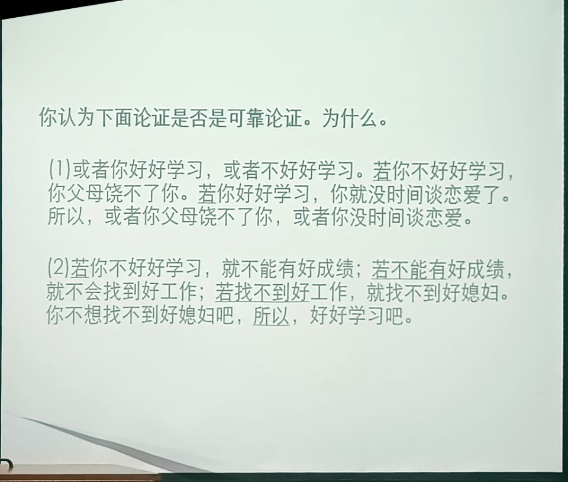

### 论证类型

- **有效论证（演绎论证）**：若条件为真，则结果一定为真
- **（强）归纳论证**： 若条件为真，则结果可能为真
- **可靠论证**：若一个论证是有效论证，且理由都是真的（合理的），那么该论证是可靠论证（Sound Argument）
- **可持论证**：若一个论证是强归纳论证，且理由都是真的（合理的），那么，该论证是可持论证（Cogent Argument）

### 例题

答：

（1）不是可靠论证，因为他不是一个有效论证（演绎论证）

（2）不是可靠论证，因为他不是一个有效论证

答：

（1）这不是一个强归纳论证，因为没有腿便无法移动，同实验结果矛盾

（2）这不是一个强归纳论证，因为枪支和锤子的杀伤性不同

### 总结

如何评价一个论证是一个好论证？

论证：

- 有效论证
- 强归纳论证

可靠论证： 有效+ 前提真（可信）

可持论证：强归纳+前提真（可信）

