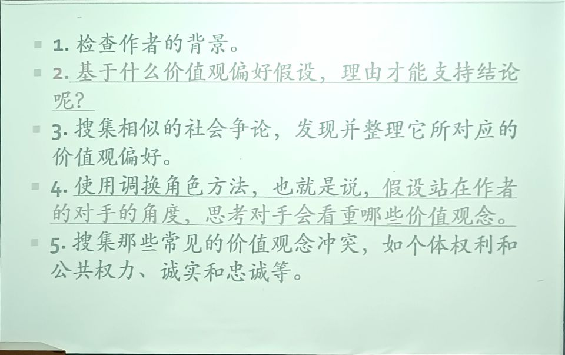
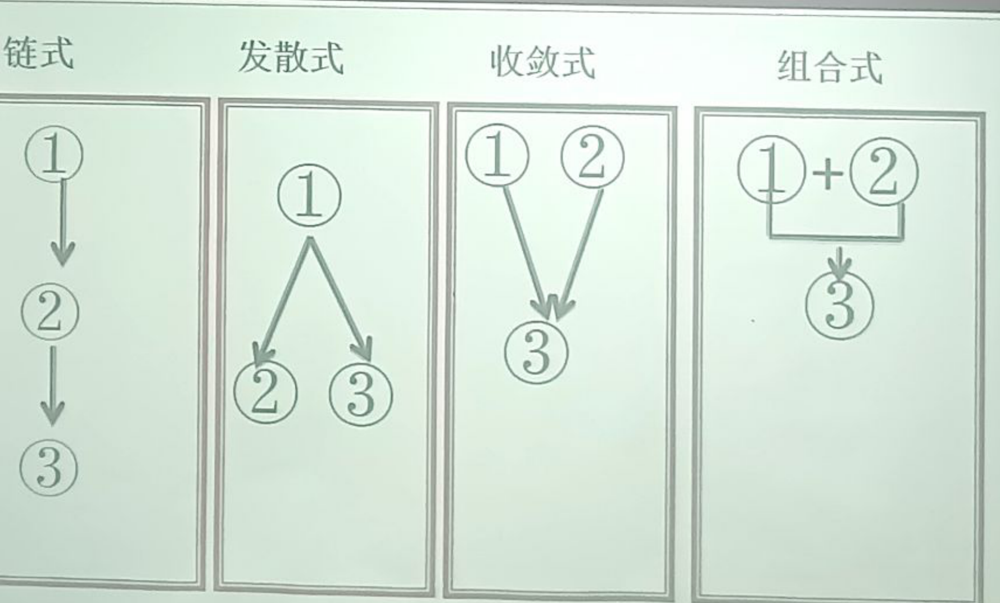
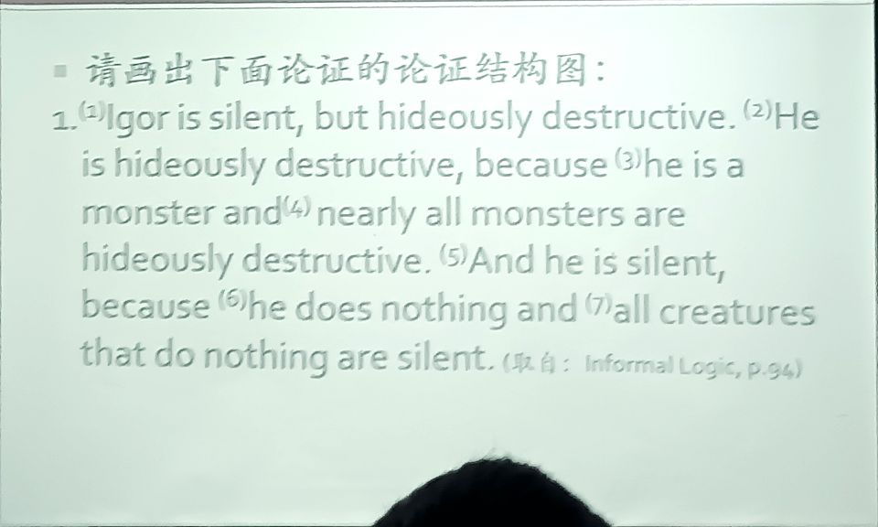
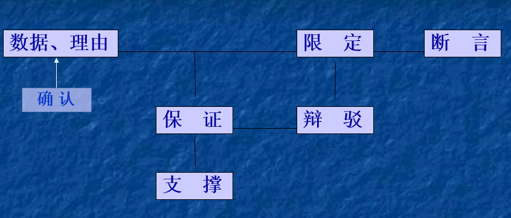
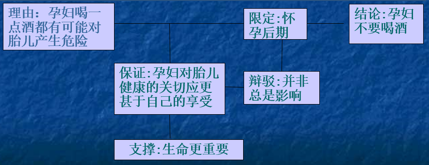

## 论证结构

#### 什么是议题

议题就是争论的问题，论证的目标就是对这些问题做出回答，并且给出合理性分析

- **规范性议题**： 关于我们应该做什么，必须做什么，允许做什么，什么是对，什么是错等的规范性问题，“应该”、“必须”、“允许”、“对”、“错”、等词汇被称作”规范性词汇“。（纵使我们有”上帝之眼“，也不能仅仅凭借”看看“，就能回答牵涉到人类做出的规范富有争议性
- **描述性议题**：是关于我们世界过去怎样、现在怎样以及将来怎样的描述性问题。（如果我们有”上帝之眼“，看看这个世界便可以知道所有描述性问题的答案，不幸的是，我们没有。也因此，对于什么引起高血压这样的议题，我们只能给出相对合理的答案，而不是the case）

#### 如何寻找议题

- 看位置：议题常常出现在标题或论证的开头

#### 如何寻找描述性假设

1. **填空原则**：寻找前提和结论之间的”缺口“，无论对于寻找价值观假设还是描述性假设都是非常重要的线索（即”如果理由为真的话，其他哪些东西为真，结论将能获得更好的支持“）
2. **寻找支持理由的理由**：某些理由的合理性是依赖于认定为真的其他路由的
3. **同一角色方法**：从作者的角度看，即找到作者的背景或者职业，试图从他的角度来完成论证
4. **转换角色法**：从反方的观点来看，想想自己站在反方立场，问自己在什么情况下，作者的论证是没有说服力的

#### **规范性假设中主要是指隐含假设**：

- 价值观偏好假设
- 最佳途径假设
- 最佳解释假设

#### 最佳途径、最佳解释隐含假设

##### 最佳途径

最佳途径可以用到实践论证中，而实践论证的结论是我们应该做某个行为，而理由是该行为能实现某个理想目标，实践论正的常见结构如下：

- **(1) 我要达到目标p**
- **(2) 若我做行为A（或采取某个方案），则能实现P**
- **所以, (3) 我要去做A（采取这个方案）** 

但是当我们补充隐含假设后

- **(1) 我要达到目标p**
- **(2) 若我做行为A（或采取某个方案），则能实现P**
- **(3) 做行为A（或采取某个方案）是实现P的最佳选择**
- **所以, (4) 我要去做A（采取这个方案）** 

##### 最佳解释

最佳解释可以用到解释性论证中：

- **(1)相机无法开机**
- **(2) 如果相机电池没电了，那么，相机无法开机**
- **所以，(3)相机电池没电了**

但是当我们补充好最佳解释隐含假设中就有：

- **(1)相机无法开机**
- **(2) 如果相机电池没电了，那么，相机无法开机**
- **(3)或许相机坏了导致，或许操作不当导致的，但是，这两种都不太可能，因为刚刚还能用，而且我已经完了几年相机了**
- **所以，(4)相机电池没电了**

常见的解释论证结构是：

- (1) P 现象发生了
- (2) 如果X，则P现象就会发生
- 所以,(3) X

完善后的解释论证结构：

- (1) P 现象发生了
- (2) 如果X，则P现象就会发生
- **(3) 与其他可能解释相比，X能更好地解释现象P**
- 所以,(4) X

##### 价值观偏好假设

即关于一个社会论题，他表现为在两个价值观念中偏好一个，或者优先考虑一个，或者以其中一个为主

**如何寻找价值观偏好假设**

#### 常见的几种论证结构模式

#### 例题

### 图尔明的论证模型

#### 组成

- 数据（data） 用来论证**事实证据**、理由
- 保证（Warrant）用来连接证据和结论之间的**普遍性原则**、假设或关系陈述，是推理的根据
- 断言（Claim）：要被证明的 **结论** 、主题、观点
- 支撑（Backings）用来支持保证（大前提）的陈述、理由
- 辩驳（Rebuttals）对已知反例、例外的考虑和反驳
- 限定（Qualifiers） 对结论的范围和强度进行限定，常来自对反例反驳的考虑

#### 图尔明模型的四个优点

- 把起不同作用的理由以不同的位置表示出来，比如保证是起着证据和结论之间的**联接**作用 
- 明确了保证本身也需要证明，当保证没有明确说出来时，图尔明模型促使你去寻找这个部分和对它的支撑，也就是寻找**隐含假设**，这样帮助你一步步地深入和扩大搜索 
- 突出了 **辩驳** 和 **限定** 的作用，这是在前面讨论的模式中没有提及的，好的论证是辨证的：包括对反例的考虑,和对结论的恰当程度的斟酌。
- 图尔明模型 **更能表述实际** 的论证模式,对分析、评价和构造论证有引导意义 

#### 举例

1. “孕妇喝一点酒都可能有害于胎儿”是理由，“孕妇不要喝酒”是结论。
2. 保证: 根据什么要求在喝酒可能对胎儿有害的证据下要求孕妇禁酒呢？显然我们需要这个基础性的假设：“胎儿的健康应比孕妇自己的享受更重要”。 
3. 支撑: 如何证明这个保证的普遍性？
4. 辩驳:图尔明模型还需要我们思考是否有反例:比如是否有事实说明少量饮酒并非有影响，或者并非总是有影响，或者影响并非不可治愈的？
5. 限定的必要:“孕妇不要喝酒”的结论是否绝对化简单化。是否需要对推理和结论做出限定？  并非唯一标准答案。

#### 保证的类型

- 演绎：前提 **必然** 导致结论
- 概括：从一些事实、例证、样板的真实性推导出更大范围的真实性，统计的归纳概括是重要的一种
- 类比：从两个十五的某些性质的相似性推导这两个事物在别的性质上相似
- 因果：某种事物是另一种事物的原因或者结果
- 权威：引用某个权威认识或机构的断言来证明观点或事实
- 原则：运用某种广泛有效、真实的原则、普遍规律来证明其适应的场合下的结果的存在。实际上是 **演绎论证**

